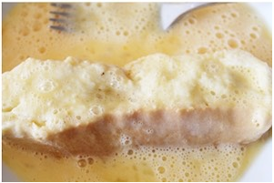

# Torrijas, ¡la MEJOR receta casera!

¡Por fin **torrijas**!… Si preguntamos por un dulce de Semana Santa estoy segura que la mayoría respondería **torrijas** porque son quizás el dulce más típico que se prepara en toda España durante la Cuaresma y la Semana Santa. Es un dulce humilde que se prepara con el pan del día anterior, aunque hoy se elabora y se comercializa pan especial para hacerlas y podemos encontrar **torrijas** de todos los sabores.

Hoy os proponemos que preparéis en casa las **torrijas caseras** clásicas, es decir, las **torrijas de leche**, para que toda la familia pueda disfrutar de este dulce tan nuestro. Los peques os pueden ayudar a rebozarlas en azúcar y canela.

## TORRIJAS DE LECHE

### *Ingredientes para las torrijas*

- 1 barra de pan del día anterior
- 1 litro de leche
- 1 rama de canela
- Piel de un limón
- 4 cucharadas soperas de azúcar
- 3 huevos
- Azúcar y canela para rebozar
- Aceite de oliva virgen

## CÓMO HACER TORRIJAS CASERAS

### *Preparamos los ingredientes para las torrijas*

1. Cortamos el pan en rodajas

    

2. Lo colocamos en una fuente

    

3. Batimos los huevos en un cuenco.

4. En un cazo ponemos la leche con la rama de canela, las 4 cucharadas soperas de azúcar y la piel de un limón. Cuando rompa a hervir retiramos del fuego y vertemos sobre el pan.

    

5. Lo dejamos unos minutos para que el pan absorba toda la leche y se empape bien.

    

### *Freímos las torrijas*

6. Ponemos una sartén con aceite de oliva virgen en el fuego.

7. Cuando esté caliente pasamos el pan por el huevo y freímos en el aceite.

    

8. Quitamos cuandeo estén doraditas

    

9. Sacamos y ponemos en un plato con papel de cocina para absorber el exceso de aceite.

    

10. Después, aún calientes, rebozamos en una mezcla de azúcar y canela.

    

##### Y ya están listas para tomar… hay a quien le gustan recién hechas y a quien le gustan frías cuando el azúcar forma un almíbar.

    
>...cualquiera puede atreverse a cocinar - Ana María (Autora de la receta)

[Sito Web - Cocinando entre Olivos](https://cocinandoentreolivos.com/)

`public class ClasePrincipal {`
`public static void main(String[] args) {`
`sentencia_1;`
`sentencia_2;`

